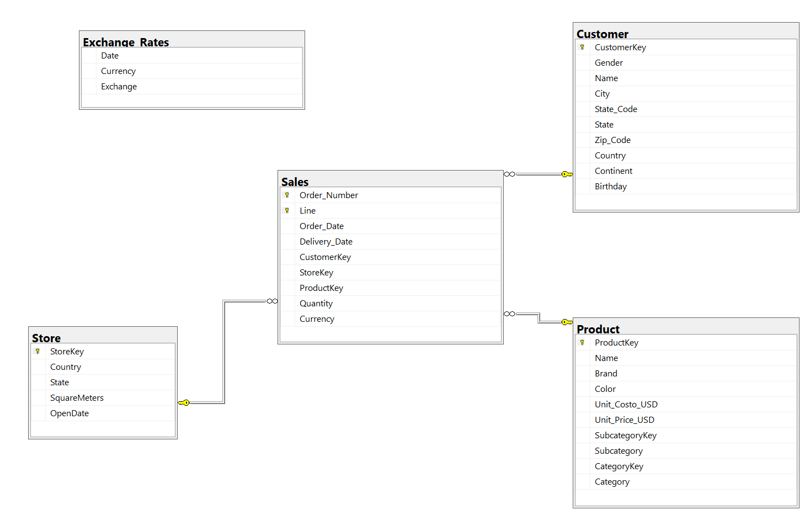

# Project SQL:Análisis Global(Ventas-Clientes)

## Resumen (Overview)
_La gerencia del area de ventas de *Mtech* desea un vistazo general de como se encuentra actualmente las ventas para poder identificar posibles fortalezas y debilidades para tomarlas en cuenta en el plan de trabajo del próximo año.

El objetivo de este proyecto es utilizar **SQL** dentro de **SQL Server Management Studio**,para poder analizar los datos y brindar recomendaciones al departamento de ventas que facilite la toma de decisiones.


## 📩 Red Social
<p align="center">
  <a href="https://www.linkedin.com/in/bryan-ricardo-l%C3%B3pez-espinoza-8b1a07324/">
    
  </a>
</p>

## Estructura del Proyecto

- [Sobre los Datos](#sobre-los-datos)
- [Ingesta de Datos](#Ingesta-de-Datos)
- [Diagrama E-R](#Diagrama-E-R)
- [Tareas](#tareas)
- [Limpieza de Datos](#limpieza-de-datos)
- [Análisis Exploratorio de Datos e Insights](#análisis-exploratorio-de-datos-e-insights)

## Sobre los Datos

Los datos originales, junto con una explicación de cada columna, se pueden encontrar [aquí](https://www.kaggle.com/datasets/bhavikjikadara/global-electronics-retailers/data).

El conjunto de datos incluye cinco tablas con información al respecto de los clientes,productos,Tiendas,Ventas,Tipo de cambio de una empresa de ventas de productos electrónicos y que tiene varios puntos de venta físicos en diferentes paises y también un punto de venta virtual.


## Ingesta de Datos

Antes de realizar el análisis,se crea la base de datos y las conexiones necesarias entre la tabla hecho y las tablas dimension,pero se realiza un proceso de limpieza para poder trabajar correctamente

```sql
-- Limpieza y normalización de tabla Productos --

UPDATE Product
SET Unit_Costo_USD=TRIM(REPLACE(REPLACE(Unit_Costo_USD,'$',''),',','')),
    Unit_Price_USD=TRIM(REPLACE(REPLACE(Unit_Price_USD,'$',''),',',''))

--Validamos que no haya ningun valor perdido
SELECT Unit_Costo_USD, Unit_Price_USD
FROM Product
WHERE TRY_CONVERT(DECIMAL(10,3),Unit_Costo_USD) IS NULL
   OR TRY_CONVERT(DECIMAL(10,3),Unit_Price_USD) IS NULL;


ALTER TABLE Product
ALTER COLUMN Unit_Costo_USD DECIMAL(10,3);

ALTER TABLE Product
ALTER COLUMN Unit_Price_USD DECIMAL(10,3);

--Insertar llave primaria en Sales,Como buena practica--

--Validamos que es unica la combinacion order_number,line y que no tenga valores null--
SELECT ORDER_NUMBER,LINE,
       COUNT(*)
FROM Sales
GROUP BY Order_Number,LINE
HAVING COUNT(*)>1;

SELECT ORDER_NUMBER,LINE
FROM Sales
where Order_Number is null or line is null;
--Hacemos que a futuro tampoco acepten valores null--
ALTER TABLE SALES
ALTER COLUMN Order_Number NVARCHAR(100) NOT NULL;
ALTER TABLE SALES
ALTER COLUMN Line NVARCHAR(20) NOT NULL;
--Se crea la Primary Key
ALTER TABLE Sales
ADD CONSTRAINT PK_Sales PRIMARY KEY (Order_Number, Line)
```
## Diagrama-E-R

Se unieron las tablas dimensiones con la tabla hecho a través de sus llaves primarias y secundarias,no se realizo la conexión entre Exchange_Rates ya que no sera utilizada en la mayoria del projecto

## Tareas (Task)

En este análisis, ayudo al departamento de Ventas a responder las siguientes Preguntas:

1. **Ventas Generales**: En terminos anuales,¿Como va las ventas y utilidad bruta de todo el grupo?
2. **Mejores resultados por tienda:** ¿Cuál es la tienda que vende más?
3. **Virtual vs Fisico:** ¿Cómo son las ventas según el canal?
4. **Productos estrella:** ¿Qué productos roto más y me generan mayor utilidad?
5. **Lead Time general:** ¿Cómo se comporta el leadtime de los pedidos del canal virtual?
6. **Clasterización del LeadTime:** ¿El promedio de tiempo de pedidos es la única medida a tomar en cuenta?
7. **Repetición del cliente:** ¿Pedidos al año por cliente?
8. **Clasterización de clientes:** ¿Cuantos clientes realizan más de una compra anual?
9. **Dolar vs Otros:** ¿Como evaluo las ventas bajo la moneda de pago o bajo una moneda estándar?
10. **Canal de entrada vs canal de ventas:** ¿Cuál es eli mpacto del tipo de canal en las ventas generales?

## limpieza-de-datos
1. Validad Datos null
```sql
  --Debido a que las tablas cuando se cargaron se definieron primary key estas no pueden ser null,pero validaremos que las llaves secundarias no tengan valores null
  SELECT *
  FROM SALES AS s
      LEFT JOIN Store AS st
      ON st.StoreKey=s.StoreKey
      left join Product AS p
      ON p.ProductKey=s.ProductKey
      left join Customer AS c
      ON c.CustomerKey=s.CustomerKey
      WHERE s.StoreKey is null 
            or s.ProductKey is null 
            or s.CustomerKey is null;
---Resultado=Todo OK
```
2. Validar  que cada tienda usa solo un tipo de moneda o varios
```sql
SELECT StoreKey,
        COUNT(DISTINCT Currency) AS number_currency
FROM Sales
GROUP BY StoreKey
ORDER BY number_currency DESC;
---Resultado=Solo la tienda virtual acepta diferentes tipos de moneda y todas las tiendas físicas reciben solo un tipo de moneda.
```
3. Validar si hay pedidos no entregados de tiendas virtuales o si en tiendas físicas se han hecho envios de delivery
```sql
--3.1 Tienda virtual
SELECT *
FROM Sales
WHERE Delivery_Date IS NULL AND StoreKey='0';
--Resultado=Todo OK
--3.2 Tienda fisica
SELECT *
FROM Sales
WHERE Delivery_Date IS NOT NULL and StoreKey<>'0';
--Resultado=Todo OK
```
4. Longitud de mis datos de tiempo
```sql
SELECT MIN(order_date) AS min,
       MAX(order_date) AS max
FROM sales;
/* Como solo se tiene hasta febrero 2021 se ignorara todo el 2021 para analizar años completos,pero como tampoco 
queremos perder esos datos, se creara una vista de tal manera que se conserve la info del 2021 */
```
5. creación de vista usada recurrentemente
```sql
 -- Ignorar el año 2021 y añadir en la tabla de hechos el costo y precio */

CREATE VIEW sales_2 AS
SELECT s.*,
       p.Unit_Costo_USD,
       p.Unit_Price_USD
FROM sales as s
    left join Product as p
    ON p.ProductKey=s.ProductKey
    WHERE YEAR(s.Order_Date)<>2021;
```
## Análisis Exploratorio de Datos (EDA) e Insights

### 1. **Ventas Generales**: En terminos anuales,¿Como va las ventas y utilidad bruta de todo el grupo?

Para responder esta pregunta se utilizaron CTE,la función de ventana LAG para captar el registro del año anterior y funciones de formato para poder dejarlo visualmente más presentable

```sql
WITH ventas_costo AS(
SELECT DATETRUNC(YEAR,Order_Date) AS Año,
       SUM(quantity*Unit_Price_USD) AS Ventas,
       SUM(quantity*Unit_Costo_USD) AS Costo,
       SUM(quantity*(Unit_Price_USD-Unit_Costo_USD)) AS UtilidadB
FROM sales_2
GROUP BY DATETRUNC(YEAR,Order_Date)
)
SELECT Año,
       FORMAT(Ventas,'N2') AS Ventas,
       FORMAT((Ventas-LAG(Ventas,1) OVER(ORDER BY Año ASC))/LAG(Ventas,1) OVER(ORDER BY Año asc),'P2') AS LYvsY_Ventas,
       FORMAT(Costo,'N2') AS Costo,
       FORMAT((Costo-LAG(Costo,1) OVER(ORDER BY Año asc))/LAG(Costo,1) OVER(ORDER BY Año asc),'P2') AS LYvsY_Costo,
       FORMAT(UtilidadB,'N2') AS UtBruta,
       FORMAT(UtilidadB/Ventas,'P2') AS MargenBruto
FROM ventas_costo;
```


**Insight**

Las ventas y costos han ido creciendo año a año a un ritmo casi simillar,y el Margen Bruto se ha mantenido entre el 58 y 59%, pero se ve un bajon marcado en el 2020 de practicamente de un 50% comparado a los resultados del 2019,habria que evaluar cual fue la causa de ese desplome,una de las hipótesis que se pueden manejar es el impacto de la Pandemia del COVID-19 pero en el dataset no tenemos datos para validar esto.

Pero a niveles anuales no se ve un desfase entre ventas - costo - utilidad bruta
que nos de una alerta con respecto al margen o con respecto a la política de costeo y de ventas.

### 2. **Mejores resultados por tienda:** ¿Cuál es la tienda que vende más?

Para responder esta pregunta se utilizo la función de ventana Dense_rank,funciones de formato y joins para poder capturar el nombre de la tienda.

```sql
--Verificamos que todas las tiendas tengan metros cuadrados
SELECT *
FROM Store
WHERE StoreKey<>'0'
and (SquareMeters is null or SquareMeters=0);
--Resultado=Todas las tiendas tienen m2 menos la tienda virtual

SELECT st.State,
       st.Country,
       DATEDIFF(YEAR,st.OpenDate,GETDATE()) AS Years,
       -- MIN(s.Order_Date) as First_Sales, para la 2da query
      -- MAX(s.Order_Date) as Last_Sales, para la 2da query
       DENSE_RANK() OVER(ORDER BY SUM(s.quantity*s.Unit_Price_USD) DESC) AS TOP_VENTAS,
       FORMAT(SUM(s.quantity*s.Unit_Price_USD),'N2') AS Ventas,
       FORMAT(SUM(s.quantity*(s.Unit_Price_USD-s.Unit_Costo_USD)),'N2') AS UtilidadB,
       ROUND(SUM(s.quantity*s.Unit_Price_USD)/MAX(st.squaremeters),3) AS Ventasxm2
FROM sales_2 AS s
    LEFT JOIN Store AS st
    ON s.StoreKey=st.StoreKey
     -- WHERE st.Country='Australia' para la 2da query
    GROUP BY st.State,st.Country,st.OpenDate
    ORDER BY Ventasxm2 DESC;
    
```


**Insight Inicial**

Un buen indicador seria ver solo las ventas y fijarse en el TOP,pero tomando en cuenta que cada tienda tienen factores ambientales diferentes, ya que no es lo mismo vender en una tienda de 200 m2 con 10 trabajadores que en una tienda de 30 m2 con 3 trabajadores,por lo
que una medida más justa seria usar las Ventas/m2.


Observamos que la tienda Online es la que ha tenido las mayores ventas superando a tiendas que tienen mucho más años de antigüedad,esto es un buen indicador a alto nivel de que el sector e-commerce es clave,pero lo que mas resalta es que la tienda Northen Territory Australia esta por debajo de los $20/m2,por lo que antes de sacar alguna conclusion sobre su viabilidad validaremos el estado de todo el grupo de tiendas de ese país


**Insight Final**

Se observa que todas las tiendas han Australia han tenido operaciones hasta el 2020,pero lo extraño es que la tienda Northern Territory solo ha tenido ventas hasta Abril del 2016 por lo que eso justificaria porque sus ventas/m2 son tan bajas, por lo que habría que preguntar si ese punto de venta sigue realmente activo o es una tienda que cerro operaciones o mapear que paso con el registro de sus ventas antes de dar una conclusión con respecto a su operatividad 

Pero en general la conclusion que si podemos llegar es que las ventas online son clave,ya que venden más que cualquier tienda fisica por lo que es una primera señal para manejar la idea de impulsar con más recursos para ese canal de venta

### 3. **Virtual vs Fisico:** ¿Cómo son las ventas según el canal?
Para responder esta pregunta utilizamos CASE WHEN las funciones de ventana en una función acumulada SUM con PARTITION BY

```sql
SELECT CASE WHEN StoreKey='0' THEN 'Virtual' ELSE 'Fisica' END AS Tipo_tienda,
       DATETRUNC(YEAR,order_date) AS year_date,
       SUM(quantity*Unit_Price_USD) AS Ventas,
       FORMAT(CAST(SUM(quantity*Unit_Price_USD) AS numeric)/SUM(SUM(quantity*Unit_Price_USD)) OVER(PARTITION BY DATETRUNC(YEAR,order_date) ),'P2') as porc_Ventas
FROM sales_2
GROUP BY CASE WHEN StoreKey='0' THEN 'Virtual' ELSE 'Fisica' END,
         DATETRUNC(YEAR,order_date)
ORDER BY Tipo_tienda DESC,year_date ASC
```
 

**Insight**

Se observa que en el 2016 las ventas virtuales comenzaron representando solo el 16.8% de las ventas anuales pero cerro el 2020 representando el 22.3% de las ventas totales,
ese aumento de practicamente 6 puntos porcentuales da indicio de que existe una tendencia al aumento constante de ventas por el canal virtual,lo que vuelve a reforzar la idea
de impulsar más ese canal.


### 4. **Productos estrella:** ¿Qué productos roto más y me generan mayor utilidad?
Para poder realizar esta pregunta usamos una vista para mejorar la lectura del código,
y funciones de ventana ,función cast para que al dividir datos enteros si me aparezca los decimales y funcion Interect para hallar el cruce.
```sql
CREATE VIEW top_movimiento AS
WITH un_vendidas AS (
SELECT ProductKey,
        SUM(Quantity) AS Total
FROM Sales_2
GROUP BY ProductKey)
SELECT ProductKey,
        Total,
        SUM(Total) OVER () AS GLOBAL,
        SUM(total) OVER (ORDER BY Total DESC ROWS BETWEEN UNBOUNDED PRECEDING AND CURRENT ROW) AS Acumulado,
        CAST(SUM(total) OVER (ORDER BY Total DESC ROWS BETWEEN UNBOUNDED PRECEDING AND CURRENT ROW) AS NUMERIC)/SUM(Total) OVER () AS Acumulado2
FROM un_vendidas;

SELECT ProductKey,
       Total,
       FORMAT(Acumulado2,'P2') AS porc_acum
FROM top_movimiento
WHERE Acumulado2<0.1;
```
 

**Insight Inicial 1**

De los 2592 skus que en algun momento se han vendido,solo 42 engloban el 10% de las ventas globales por lo que estos son los productos clave a nivel de rotación que no deberian faltar en todas las tiendas ,asi que se deberia revisar si existen inventarios de seguridad de acuerdo para evitar quiebres de stock.

Un análisis más profundo sería validar por cada pais que productos son los de mayor rotación y enfocarse en su disponibilidad en las tiendas de cada pais,eso se podría hacer en un 2do nivel de análisis
```sql
CREATE VIEW top_utilidad AS
WITH utilidad_bruta AS(
SELECT ProductKey,
        SUM(Quantity*(Unit_Price_USD-Unit_Costo_USD)) AS Utilidad_B
FROM Sales_2
GROUP BY ProductKey)
SELECT ProductKey,
        Utilidad_B,
        SUM(Utilidad_B) OVER () AS GLOBAL,
        SUM(Utilidad_B) OVER (ORDER BY Utilidad_B DESC ROWS BETWEEN UNBOUNDED PRECEDING AND CURRENT ROW) AS Acumulado,
        CAST(SUM(Utilidad_B) OVER (ORDER BY Utilidad_B DESC ROWS BETWEEN UNBOUNDED PRECEDING AND CURRENT ROW) AS NUMERIC)/SUM(Utilidad_B) OVER () AS Acumulado2
FROM utilidad_bruta;

SELECT ProductKey,
       Utilidad_B,
       FORMAT(Acumulado2,'P2') AS porc_acum
FROM top_utilidad
WHERE Acumulado2<0.1;
```
 

**Insight Inicial 2**

De los 2592 skus que se han vendido solo 11 skus engloban el 10% de la Utilidad Bruta de forma histórica,por lo que si realizamos un cruce con los de alta rotacion
Encontaremos los productos clave tanto en movimiento como en rotación que serian nuestros productos estrella.
```sql
SELECT * FROM
Product
WHERE ProductKey in 
(
SELECT ProductKey
FROM top_movimiento
WHERE Acumulado2<0.1

INTERSECT   --Queremos aquellos skus que son de alta rotación y de alta utilidad

SELECT ProductKey
FROM top_utilidad
WHERE Acumulado2<0.1);
```
 

**Insight Final**

Podemos ver que nos sale 7 skus clave pero en si son solo 2 productos solo que en diferente presentacion de colores,por lo que en un análisis más profundo se podria ver cuanto influye el color en la venta de un mismo producto.
Igualmente se recomienda realizar el análisis a nivel de cada pais para poder observar el comportamiento real de cada grupo de tiendas por país.

5. **Lead Time general:** ¿Cómo se comporta el leadtime de los pedidos del canal virtual?
```sql
WITH pedidos_unicos AS(
SELECT distinct order_number,order_date,delivery_date
FROM Sales_2
WHERE StoreKey='0')

SELECT COALESCE(CAST(YEAR(order_date) AS VARCHAR),'Total') AS year_order,
        MAX(datediff(day,Order_Date,Delivery_Date)) AS max_leadtime,
        avg(datediff(day,Order_Date,Delivery_Date)) AS avg_leadtime,
        Min(datediff(day,Order_Date,Delivery_Date)) AS min_leadtime
FROM pedidos_unicos
GROUP BY CUBE(year(order_date));
```
 

**Insight**

Se ve que el promedio de dias de entrega ha pasado de 7 dias en el 2016 a 4 dias desde el 2018 en adelante,lo cual es una reducción considerable y es una buena señal de que el servicio de envio ha ido mejorando a través de los años,pero también se ve que hay casos donde el tiempo ha sido hasta de 17 o 13 dias por lo que para validar la mejora del envio año tras año se realizará un análisis más profundo a continuación.

6. **Clasterización del LeadTime:** ¿El promedio de tiempo de pedidos es la única medida a tomar en cuenta?
7. **Repetición del cliente:** ¿Pedidos al año por cliente?
8. **Clasterización de clientes:** ¿Cuantos clientes realizan más de una compra anual?
9. **Dolar vs Otros:** ¿Como evaluo las ventas bajo la moneda de pago o bajo una moneda estándar?
10. **Canal de entrada vs canal de ventas:** ¿Cuál es eli mpacto del tipo de canal en las ventas generales?